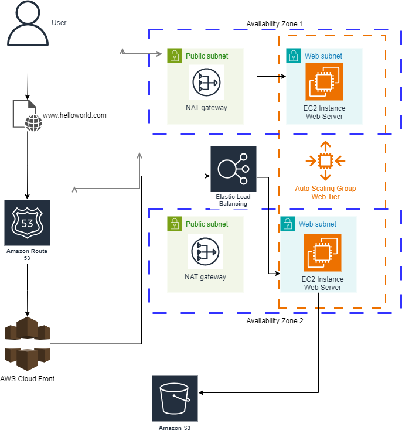

# 🚀 **AWS Static Website Deployment - Improved Architecture**

.png>)

This document outlines an **improved architecture** for deploying a **static website** on AWS. The new design focuses on **high availability**, **global performance**, and **cost optimization**, leveraging a simple and efficient approach by using Amazon **S3** and **CloudFront**.

---

## 🏗️ **Old Architecture Overview**:

Previously, the static website was deployed using a more complex setup. While functional, the old architecture had unnecessary components, which added **costs** and **complexity**.

### 🛠️ **Old Components**:

1. **Elastic Load Balancer (ELB)** to distribute incoming traffic.
2. **EC2 Instances** to serve dynamic web content.
3. **Auto Scaling Group** to handle scaling based on demand.
4. **Amazon S3** to store static website content.
5. **Amazon CloudFront** as the Content Delivery Network (CDN).
6. **Amazon Route 53** for DNS management.

While robust, this design was **overkill** for a static website, increasing operational costs without added benefits.

---

## 🌟 **New Architecture: Simplified and Optimized**

The **new architecture** focuses on using **Amazon S3** to host static content and **Amazon CloudFront** to distribute the content globally, providing **low-latency** and **high availability** without the need for compute resources like **EC2** or a **Load Balancer**.

### 🗺️ **Key Components of the New Architecture**:

1. **Amazon S3**: Stores all static website assets (HTML, CSS, JS, images, etc.).
2. **Amazon CloudFront**: A globally distributed CDN that ensures fast content delivery.
3. **Route 53** _(optional)_: DNS service to map the domain to the CloudFront distribution.

### 🧹 **What's Removed**:

- **No more Elastic Load Balancer (ELB)**.
- **No need for EC2 Instances**.
- **Auto Scaling is inherently managed by CloudFront**, eliminating manual scaling setups.

---

## 🔍 **Old vs. New Architecture Comparison**

| **Feature**              | **Old Architecture**                  | **New Architecture**                        |
| ------------------------ | ------------------------------------- | ------------------------------------------- |
| **Compute Resources**    | EC2 Instances + Auto Scaling Group    | No compute resources needed                 |
| **Traffic Distribution** | Elastic Load Balancer                 | CloudFront (CDN)                            |
| **Scalability**          | Managed by Auto Scaling Group         | CloudFront auto-scales globally             |
| **Cost**                 | Higher (due to EC2, ELB, and scaling) | Lower (S3 + CloudFront only)                |
| **Availability**         | EC2 in multiple availability zones    | S3 + CloudFront's global edge locations     |
| **Global Performance**   | CloudFront + EC2 backends             | CloudFront with S3 origin (faster, cheaper) |

---

## 🏗️ **Updated Architecture Diagram**

The new architecture consists of:

- **Amazon S3**: Hosting the static content.
- **Amazon CloudFront**: Distributing content from edge locations to ensure low-latency access.

---

## 🛠️ Traffic Flow in the New Architecture:

- **User Access**: The user visits the website via the domain name (e.g., [www.helloworld.com](http://www.helloworld.com)). **Route 53** (if used) directs the request to **CloudFront**.

- **Content Delivery**: **CloudFront** serves cached content from its global edge locations to reduce latency.

- **Fetch from Origin**: If the requested content is not cached, **CloudFront** retrieves it from **S3**.

- **Global Scalability**: **CloudFront** scales automatically as traffic increases, ensuring a seamless user experience.

---

## 🎯 Key Benefits of the New Architecture:

- **Cost Efficiency**: Without EC2 instances, load balancers, or manual scaling, this solution is **significantly cheaper**.

- **High Availability**: **S3** and **CloudFront** ensure **99.99% uptime**, distributed across multiple edge locations.

- **Low Latency**: **CloudFront** ensures that users around the world receive content from the **nearest edge location**, reducing latency.

- **Automatic Scalability**: **CloudFront** automatically scales to handle traffic spikes, with no need for additional configuration.

---

## 🔧 Future Enhancements:

- **Integrate AWS WAF** (Web Application Firewall) for enhanced security.

- Use **Route 53** to manage custom domain names.

- Implement **logging and monitoring** for deeper traffic insights and better security.

---

With this new, optimized architecture, the static website can deliver **high performance**, **global reach**, and **cost-efficiency**, ensuring a seamless experience for users around the world.

---

**Author**: Carlos Lopez
**Project**: AWS Static Website with Terraform
# AWS_Static_Hello_World_page_Cloud
